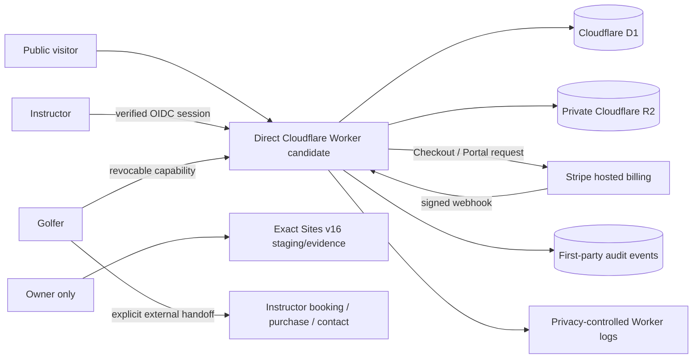

# Production SaaS Architecture

**Document status:** Current architecture record under `AUTH-005` and `TECH-006`; direct Cloudflare is a verification candidate, not a deployed or accepted production release
**Scope:** Bounded Canada-wide self-serve V1 for one independent golf instructor and the instructor's golfers
**Last updated:** 2026-08-09
**Related:** [Security and Privacy](SECURITY_PRIVACY.md), [Operations](OPERATIONS.md), [Requirements Traceability](REQUIREMENTS_TRACEABILITY.md)

## Authority and decision language

`[SUPPORTED BY BUSINESS PLAN V2]` The product is a Canada-wide, self-serve B2B SaaS product for individual independent golf instructors. It helps an instructor turn coach-owned assessment information into a personalized, coach-branded roadmap and player journey. It preserves the instructor's judgment and existing booking, package-payment, communication, video, and analysis tools.

`AUTH-005` authorizes production architecture selection and implementation for that bounded V1. In this document, **selected** means an implementation decision made under that authority. It does not mean the provider account is provisioned, the behavior is verified, or Aaron has accepted a live release.

The historical design gate is not an active implementation gate. Unresolved matters named here are evidence or operational dependencies. Work may continue around them, but affected real operations must not be represented as working until direct evidence exists.

`TECH-006` supersedes OpenAI Sites as the final paid live-V1 host. Exact Sites
version 16 remains owner-only private staging/evidence. Direct Cloudflare Workers
with D1/R2 is the least-change successor candidate to verify; no Cloudflare
account, credentials, domain, public access, production data migration, OIDC
provider, charge, deployment, or acceptance is implied by that selection.

## Bounded V1 system

The production system has four user-facing surfaces:

1. a public acquisition and realistic synthetic-sample surface;
2. a signed-in instructor workspace for identity, package setup, golfer records, roadmap authoring, preview, publishing, lifecycle updates, and subscription management;
3. a private golfer experience reached through a revocable capability link; and
4. hosted Stripe Checkout and Customer Portal surfaces for the instructor's SaaS subscription only.

The golfer's purchase, booking, or contact action remains an instructor-owned external link. It is not processed by this SaaS and must never be confused with the instructor's Stripe subscription.



## Selected stack

| Decision | Selection | V1 responsibility | Important limitation or revisit trigger |
|---|---|---|---|
| `ARCH-001` application and hosting | Direct Cloudflare Workers candidate using the existing vinext/React/TypeScript Worker bundle; exact Sites v16 retained only as owner-private staging/evidence | Server-rendered and interactive public, instructor, golfer, and route-handler surfaces; static assets; deployment wiring | The successor account/resources are not authorized or provisioned, its direct deployment profile remains local evidence, and no public-domain or accepted-release claim exists. |
| `ARCH-002` structured persistence | Cloudflare D1, accessed through server-side data helpers and versioned migrations | Instructor accounts, tenant-owned product records, roadmap state, share-capability records, subscription projection, idempotency records, and audit events | Migration, backup, restore, capacity, and production-binding behavior require direct environment evidence. |
| `ARCH-003` object storage | Private Cloudflare R2 | Approved coach branding, optional golfer evidence/media, generated exports, and other blobs; D1 retains metadata and ownership | Media policy, limits, validation/scanning behavior, retention, and restore handling remain unresolved. R2 is not a public file origin. |
| `ARCH-004` instructor identity | Provider-neutral OpenID Connect boundary for the direct host, with authorization code, PKCE, state, nonce, verified issuer/audience/signature, stable issuer-plus-subject identity, and revocable server-side sessions; exact provider/policy pending | Instructor authentication and server-side attribution of account actions without an app-owned password database | The deployed Sites runtime still depends on dispatch SIWC. Direct-host OIDC is implemented and locally tested, but no provider is configured, hosted, or accepted; missing/invalid configuration fails closed, and existing accounts are never silently merged by email. |
| `ARCH-005` golfer access | High-entropy, revocable capability links whose verifier is hashed at rest; publish, exchange, every session read, and response require current account `golfer_record` plus golfer `roadmap_sharing` grants | Private read access to one published golfer experience without requiring a golfer account; withdrawal transactionally revokes links and sessions | A bearer capability can be forwarded by its recipient before revocation. Exact consent meaning/copy, recipient comprehension, and hosted acceptance evidence still require owner and qualified review. |
| `ARCH-006` SaaS billing | Stripe Checkout, Customer Portal, and signed webhooks, planned behind server routes | Instructor subscription creation and self-service billing/account management | Production Stripe credentials, the exact approved Stripe Price, tax/refund/failure policy, webhook endpoint, and controlled live transaction evidence are unresolved. |
| `ARCH-007` observability | First-party structured audit events plus direct Workers observability with invocation logs disabled | Security/account/data-change traceability and runtime diagnosis | Official direct-Workers controls exist, but an exact hosted candidate must prove enforcement, retained-data disposition, privacy-safe diagnostics, correlation, alert routing, and failure delivery. Sites `LOG-PRIV-001` remains open for the staging host. |
| `ARCH-008` delivery | Instructor copies a private golfer link and uses an existing communication channel | Completes the share operation without introducing an outbound messaging provider | The app records publish/link lifecycle, not delivery or message receipt. No success copy may imply an email or message was sent. |
| `ARCH-009` privacy-operator access | Verified instructor identity plus a separate HMAC-SHA-256 normalized-email digest allowlist and dual network/operator abuse controls | Least-privilege access to a strict newest-first keyset queue, one-request count-only inventory, read-only verification/processing/terminal history, and only a non-attesting identity-verification-required marker | The Sites staging path currently uses SIWC; the successor requires verified OIDC. Verification method/evidence, named operator, approved policy, hosted identity evidence, processing, denial/cancellation authority, fulfillment, and deletion remain unresolved. Product owner/subscriber access does not imply this role. |

The package lockfile is the version authority for implementation dependencies. Documentation does not promise compatibility beyond the exact built and tested release.

## Component responsibilities

### Application Worker and hosting lineage

- Render public pages without requiring authentication.
- Require a verified server-owned identity session on all instructor-owned reads and writes; Sites staging continues to use its outer SIWC boundary until superseded.
- Perform every authorization decision on the server.
- Validate inputs and output-encode coach-authored content.
- Coordinate D1 transactions and private R2 access.
- Exchange golfer capabilities for a scoped session.
- Create Stripe Checkout and Portal sessions for the authenticated instructor.
- Verify and idempotently process Stripe webhooks.
- Emit minimal first-party audit events and privacy-safe operational logs.
- Apply security headers, request-size limits, rate limits, and safe error responses.

### D1

D1 is the authoritative product-state store. The logical domains are:

| Domain | Representative records | Ownership rule |
|---|---|---|
| Identity | instructor, external identity mapping, account state | An app-generated immutable instructor ID owns tenant data. A provider claim is an identity mapping, not a client-supplied tenant key. |
| Coach setup | coach profile, bounded brand settings, external contact/action link | Exactly one instructor tenant in V1. |
| Package | coach-owned package name, purpose, price/currency, terms, external action | Instructor-authored and explicitly confirmed before publication. |
| Golfer | minimal adult golfer identifier and goal/context | Belongs to one instructor; never queried by a client-provided instructor ID. |
| Roadmap | assessment, strengths, barriers, phases, active phase, lessons, practice, evidence, phase review, publication version | Draft and published versions remain distinguishable. Coach judgment is never generated autonomously. |
| Share access | share ID, hashed verifier, status, issued/revoked/expiry metadata, publication version | Grants only the documented golfer read scope for one published roadmap. |
| Abuse control | scoped HMAC subject digest, fixed-window boundary, atomic request count | Short-lived operational rows contain no raw network address, capability, account ID, email, or request content. |
| Consent records | Append-only policy-versioned grant/withdraw history and minimal audit receipt | Account ownership comes from authenticated server context; new grants fail closed without exact owner-supplied registry configuration, and no record activates optional processing by itself. |
| Billing | Stripe customer/subscription identifiers, processed event IDs, entitlement projection | SaaS subscription only; webhook-derived state is authoritative for billing events. |
| Audit | timestamp, actor class/ID, action, target type/ID, result, request ID, minimal change metadata | Append-oriented and not exposed as ordinary tenant content. |

Every tenant-owned row carries an `instructor_id` or is reachable only through a foreign-key path that does. Server repositories take the authenticated instructor context as a required argument. Client input may name a resource but may not choose its tenant owner.

### R2

- Store bytes under opaque, non-user-controlled keys scoped to an instructor and asset record.
- Keep original filename, content type, byte length, checksum, ownership, consent/status, and lifecycle metadata in D1.
- Serve private objects only through an authorized Worker response; do not expose the bucket or permanent public object URLs.
- Treat uploads as quarantined until type, size, and any approved safety checks pass.
- Delete or retain objects only through the same policy-driven lifecycle as their D1 metadata.
- Keep optional media non-blocking; a complete text-only roadmap remains supported.

### Stripe

- Checkout and Portal sessions are created only by authenticated server routes.
- The instructor's immutable account ID is carried in Stripe metadata where appropriate; price and amount are never trusted from the browser.
- Webhook signatures are checked against the raw request body before parsing or mutation.
- Stripe event IDs are unique in D1 so replay is harmless.
- Subscription state is projected from accepted events; browser redirects are not treated as payment proof.
- Access changes caused by failure, cancellation, or pause follow approved policy and are auditable.
- Coach-package prices and links never use the SaaS Stripe account.

## Identity and authorization model

### Instructor

Exact Sites v16 currently receives dispatch-owned SIWC identity. That mechanism is
staging history, not the final public-host identity design. The current direct-host
implementation strips all browser-supplied identity headers, completes a standards-
based OIDC authorization-code flow with PKCE/state/nonce, validates discovery and
ID-token issuer, audience, RS256 signature, expiry, and nonce, then injects identity
only from a live revocable server-side session. The app keeps its immutable
`instructor_id` and maps the stable `(issuer, subject)` pair to it. This boundary has
local automated evidence only; no provider configuration or hosted identity journey
exists.

Email and display name are profile attributes, not identity keys. OpenID Connect
only guarantees issuer plus subject as the stable identifier; a verified email
collision with an existing different identity must fail closed into an explicit
account-link/recovery process. The internal `instructor_id` remains stable.

Authentication does not by itself establish a business entitlement. The server
also checks account state and Stripe-derived entitlement for paid-only writes.
Public content and the golfer capability flow do not use instructor OIDC.

`[REAL-WORLD VALIDATION REQUIRED]` The exact OIDC provider/policy, public self-serve suitability, sign-in UX, account linking/recovery, issuer-and-subject continuity, sign-out, session revocation, cross-device behavior, and support escalation must be approved and verified with the exact hosted configuration. This is an unresolved evidence dependency, not a return to the retired design gate.

### Golfer capability exchange

The selected capability pattern minimizes token exposure:

1. Generate at least 32 random bytes with a cryptographically secure generator.
2. Put the raw verifier in the URL fragment of a link shaped like `/r#token={verifier}`. The route contains no public share-record identifier, and fragments are not sent in the initial HTTP request.
3. First-party browser code sends the verifier in a POST body to a same-origin exchange endpoint, then clears the fragment with `history.replaceState`.
4. The server derives an HMAC-SHA-256 fingerprint using a dedicated secret pepper and resolves the active D1 share-link record by that fingerprint.
5. On success, issue a short-lived, `Secure`, `HttpOnly`, `SameSite=Lax` scoped session cookie that cannot outlive the share capability, then navigate to a token-free golfer URL.
6. Revoke or rotate by changing the share record; the raw verifier is never stored, logged, placed in analytics, or returned after creation.

Before exchange, the public share route reveals no golfer, coach, roadmap, or existence detail. Invalid, expired, and revoked capabilities return the same neutral response class. Rate limiting applies to exchange attempts. The golfer session is read-only unless a later explicit decision defines a narrowly scoped correction/request action.

If fragment exchange is incompatible with the supported browser or accessibility matrix, the replacement must still keep the verifier out of query strings, referrers, analytics, and routine logs. A path-token fallback is not accepted without deployed log-redaction evidence.

## Critical flows

### Instructor acquisition and activation

```text
Public explanation and synthetic sample
→ verified OIDC sign-in
→ account and coach identity
→ package and external action
→ adult golfer and goal
→ coach-owned assessment, barriers, and phases
→ exact golfer preview
→ coach confirmation
→ publish and create capability
→ instructor copies link
→ minimal return state
```

Draft save is not publication. Link creation is not message delivery. A golfer opening a link is not a package sale. These states must remain separately named in data, UI, audit events, and tests.

### Golfer experience

After capability exchange, the golfer sees the approved coach-authored experience in a coherent narrative: Now, Goal, Roadmap, Lessons, Practice, Evidence, and Phase Review. A missing optional asset or data point renders an honest text-only state. The package action warns before leaving for the instructor's external destination and keeps ask, wait, decline, reassessment, or independent-practice alternatives visible where applicable.

The private Milestone/referral concept is not part of the bounded production V1 unless a later explicit scope decision includes it. Native messaging, booking, and coach-package payment remain excluded.

### SaaS subscription

```text
Authenticated instructor
→ server-created Checkout session using configured Stripe Price
→ hosted Checkout
→ signed webhook accepted and recorded idempotently
→ entitlement projection updated
→ instructor sees accurate account state
→ server-created Customer Portal session for supported changes
```

`[PRICING HYPOTHESIS — REQUIRES VALIDATION]` No amount in planning material is approved merely because a route can accept a Stripe Price ID. Production configuration must point to the exact owner-approved product/price and the UI/legal copy must match it.

### Publish and update consistency

- Authoring writes update a draft, not the published golfer view.
- Publication creates an immutable publication version or a versioned snapshot reference.
- A live capability resolves to a specific approved publication version until the instructor intentionally publishes an update.
- An update either atomically advances the share to the new version or leaves the prior version readable; partial publication is not exposed.
- Revocation takes precedence over cached content and sessions.
- R2 objects referenced by a published version are not deleted until no retained version needs them and policy permits deletion.

## Environment and configuration boundaries

| Environment | Data rule | External effects | Evidence expectation |
|---|---|---|---|
| Local | Synthetic or generated test data only | Stripe test mode or fakes; no customer messages | Build, unit/integration tests, migrations, and developer checks |
| Preview | Approved non-production test accounts and non-sensitive fixtures | Stripe test mode; no production package links unless explicitly controlled | Production-like journey, authorization, accessibility, and failure-path evidence |
| Production | Authorized real adult user data under published policy | Approved OIDC, D1/R2, Stripe, domain, and explicitly initiated external handoffs | Smoke checks, controlled transaction evidence, monitoring, backup/restore, and Aaron's exact-release acceptance |

The Sites-only resource declaration in `.openai/hosting.json` remains the private
staging manifest. A direct deployment profile must be generated from a fresh exact
build using explicit non-secret Worker, D1, R2, and canonical-URL inputs, while all
secrets stay in the authorized Cloudflare secret store. Generated deployment
configuration is local evidence and must not be committed. Environment identity
must be explicit so preview/staging cannot silently use production data, public
OIDC, or Stripe live mode.

## Deliberate exclusions

`[SUPPORTED BY BUSINESS PLAN V2]` The initial architecture does not implement:

- facility, academy, team, or enterprise account administration;
- native golfer booking, scheduling, coach-package checkout, payment, invoicing, or refunds;
- a coach marketplace or public golfer roadmap;
- autonomous diagnosis, coaching, roadmap generation, package recommendation, or performance prediction;
- launch-monitor, CRM, booking, payment, messaging, or media-analysis integrations;
- custom website/branding delivery, managed roadmap creation, or concierge onboarding;
- an unbounded dashboard, revenue-attribution engine, social feed, gamification system, or speculative reporting;
- junior-golfer accounts or data;
- operation outside Canada; or
- AI features of any kind.

## Alternatives and rationale

| Area | Selected | Deferred/rejected for bounded V1 | Rationale |
|---|---|---|---|
| Hosting | Direct Cloudflare Worker/D1/R2 candidate; Sites v16 retained private for staging/evidence | Continued Sites use as the paid host, or a separate Node/multi-service deployment | Preserves the existing Worker-compatible bundle while moving to a surface with documented direct cron and log controls; exact hosted proof is still required. |
| Persistence | D1 | Browser storage or an external managed SQL service | Durable tenant records require server-authoritative relational ownership and migrations. |
| Files | Private R2 | Public asset URLs or blobs in D1 | Keeps file bytes private and separate from searchable ownership metadata. |
| Instructor identity | Provider-neutral OIDC relying-party boundary; exact provider pending | Sites-dispatch SIWC as public identity, app-owned passwords, or hand-rolled JWT validation | Supports a portable public host while retaining provider-managed primary authentication; the application still owns short-lived transaction and revocable session state. |
| Golfer access | Revocable capability | Mandatory golfer account or public link | Keeps the viewing path low-friction while providing revocation and server-side scope. |
| SaaS billing | Stripe hosted surfaces | Custom card capture | Keeps card collection outside the app and makes webhook events the billing authority. |
| Sharing delivery | Copy link | Email/SMS provider | Meets the V1 share need without introducing consent, deliverability, and messaging operations. |
| Observability | First-party audit + privacy-controlled direct Workers diagnostics | Sites logs or third-party product analytics by default | Separates accountable change history from minimal runtime diagnostics and creates a path to close `LOG-PRIV-001`; hosted enforcement remains unproved. |

## Unresolved evidence and operational dependencies

These do not invalidate the selected architecture and do not reinstate a design gate. They limit what can truthfully be called live or accepted:

| Dependency | Evidence required before the affected live claim |
|---|---|
| Public OIDC provider and policy | Aaron-approved provider/account, issuer/client/redirect configuration, end-to-end sign-in/linking/recovery/sign-out/revocation tests, issuer-plus-subject handling, and support path for external instructors |
| Stripe production credentials and exact price | Authorized account ownership, approved Price ID and commercial copy, webhook secret, tax/refund/failure policy, and controlled live transaction evidence |
| Public domain | Authorized domain, DNS/hosting configuration, transport and redirect checks, and final-origin security-header/cookie verification |
| Legal and privacy copy | Qualified review plus published copy that matches actual consent, sharing, retention, deletion, billing, and support behavior |
| Backups and recovery | Documented D1/R2 procedure, retained evidence, successful restore exercise, measured recovery result, and named operator |
| Direct-host logging and cron | Exact hosted enforcement of disabled invocation logs, retained-data disposition, privacy-safe correlation, trigger metadata, at least three observed intervals, and exercised alert delivery; Sites `LOG-PRIV-001` remains open for staging |
| Live acceptance | Exact release/version, public URL, controlled critical-journey evidence, residual-risk record, and Aaron's dated acceptance decision |

No section of this document claims legal compliance, security certification, availability level, successful restore, successful billing, production deployment, or owner acceptance.
